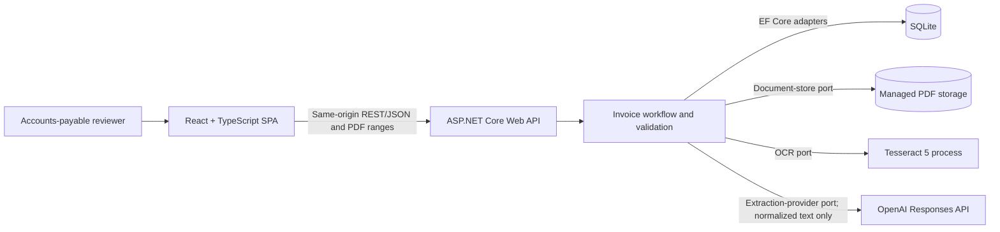
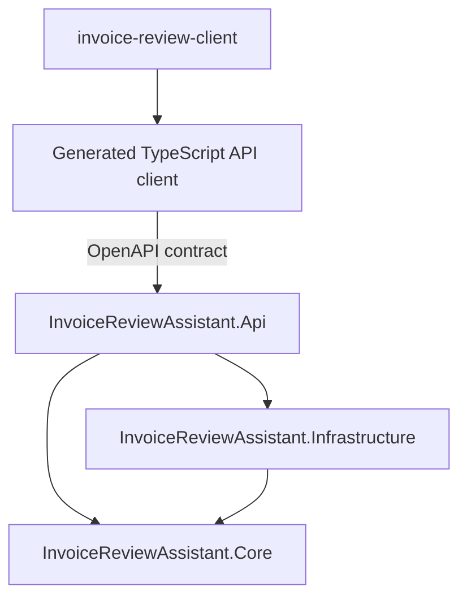
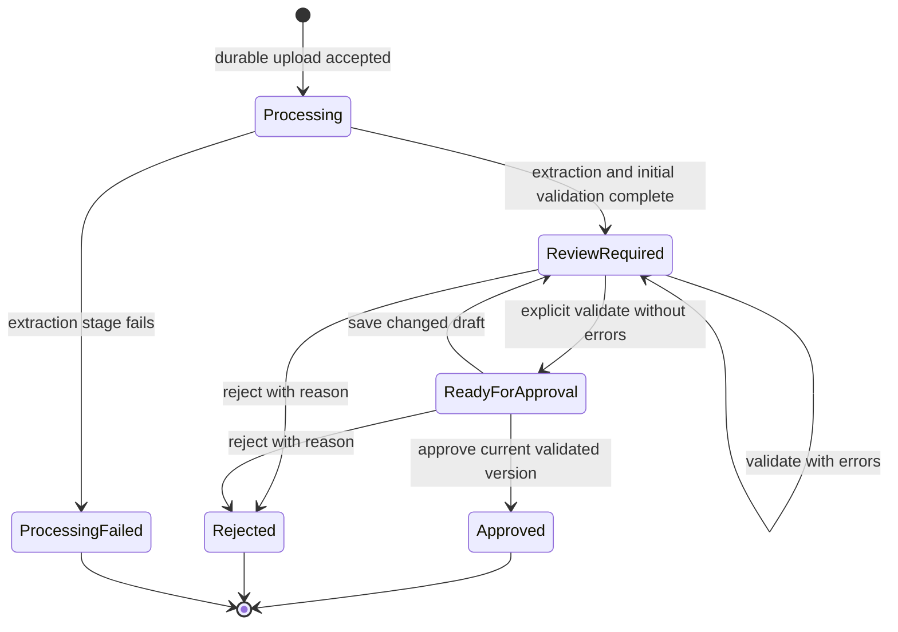
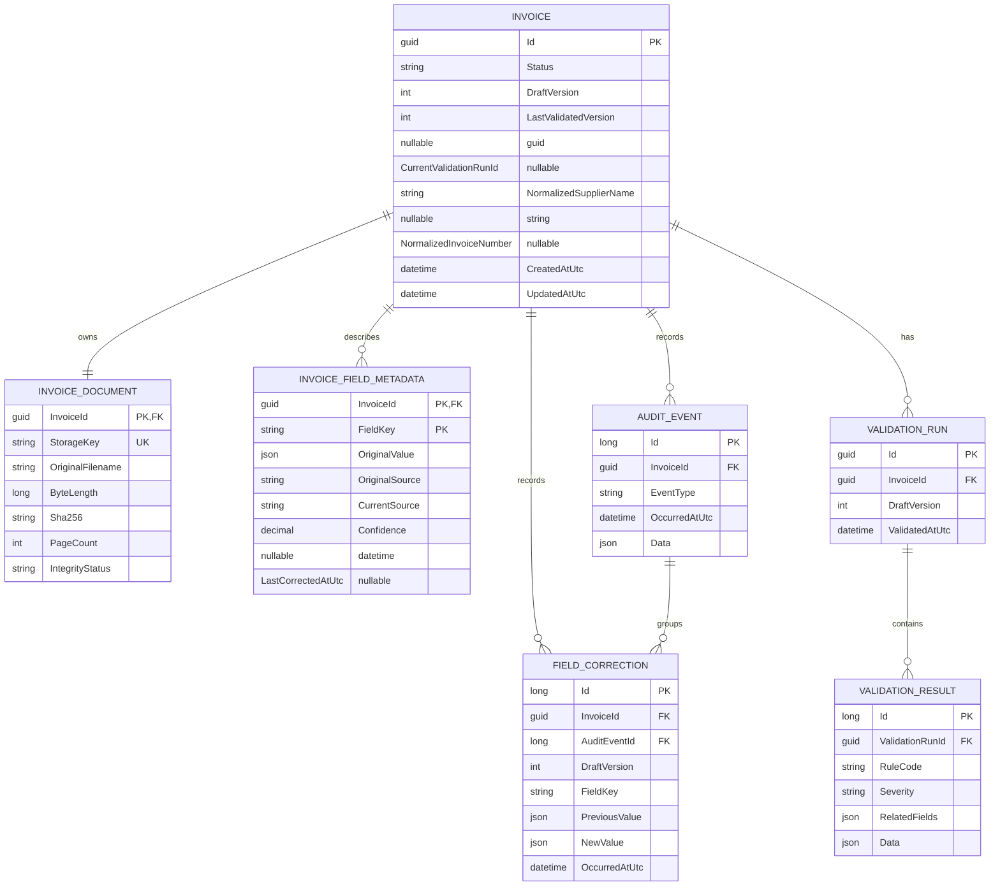
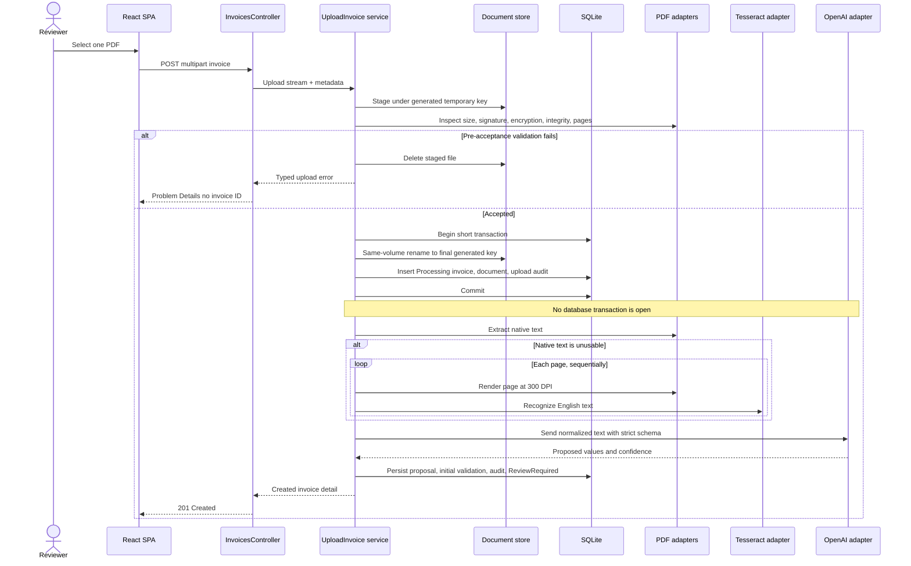
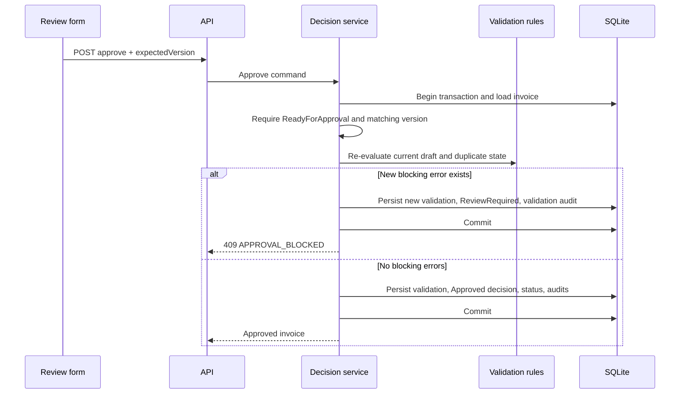

# Invoice Review Assistant: Architecture

| Document attribute | Value |
| --- | --- |
| Product | Invoice Review Assistant |
| Release | MVP / portfolio demonstration |
| Status | Accepted implementation architecture |
| Platform | Local web application |
| Last updated | September 13, 2026 |
| Requirements authority | [`PRD.md`](PRD.md) |
| Accepted decisions | [`docs/DECISIONS.md`](docs/DECISIONS.md) |

## 1. Purpose and authority

This document defines the build-ready architecture for the Invoice Review Assistant MVP. It translates the product requirements and accepted implementation decisions into component boundaries, domain and persistence models, transaction rules, provider interfaces, failure handling, and frontend integration rules.

The documents have the following precedence:

1. `PRD.md` controls product scope, required behavior, and acceptance criteria.
2. `docs/DECISIONS.md` controls the implementation choices it explicitly resolves.
3. This document controls the architecture within those boundaries.
4. [`docs/CONTRACTS.md`](docs/CONTRACTS.md) controls exact HTTP request and response schemas, query parameters, pagination shapes, Problem Details and stable error codes, JSON export shape, and the extraction JSON Schema within the architectural boundaries defined here.

If implementation needs to depart from an accepted decision, update `docs/DECISIONS.md` first with the reason, consequences, and superseded decision. Do not hide an architectural change inside code.

## 2. Architectural drivers

The architecture is optimized for these constraints:

- A single reviewer runs the application locally; authentication, authorization, and multi-user coordination are outside the MVP.
- ASP.NET Core owns financial validation, workflow transitions, persistence, audit history, and approval eligibility.
- AI proposes values. Its confidence never establishes financial validity and never authorizes a transition.
- The source PDF, current record, original extracted values, corrections, validations, and decisions survive process restarts.
- External OCR and AI work is synchronous from the caller's perspective, but no database transaction remains open while either provider runs.
- Windows, macOS, and Linux are supported without operating-system-specific domain or persistence contracts.
- SQLite and managed local files are the only durable stores.
- The design favors explicit services and feature cohesion over framework-heavy indirection.

The result is a modular monolith: one deployable ASP.NET Core process, one React application, one SQLite database, and one application-managed document directory.

## 3. System context



The browser never accesses SQLite, storage paths, Tesseract, or OpenAI directly. The API never returns prompts, normalized invoice text, provider responses, credentials, stack traces, or local paths.

## 4. Solution and dependency structure

```text
InvoiceReviewAssistant.sln

src/
  InvoiceReviewAssistant.Api/
  InvoiceReviewAssistant.Core/
  InvoiceReviewAssistant.Infrastructure/
  invoice-review-client/

tests/
  InvoiceReviewAssistant.Core.Tests/
  InvoiceReviewAssistant.IntegrationTests/
  invoice-review-client/
  InvoiceReviewAssistant.EndToEndTests/
```

### 4.1 Dependency rule



- `InvoiceReviewAssistant.Core` contains domain types, the `Invoice` aggregate, application use cases, deterministic validation rules, provider ports, persistence ports, and provider-neutral result types. It references only the .NET base libraries.
- `InvoiceReviewAssistant.Infrastructure` references Core. It implements EF Core persistence, SQLite configuration, local document storage, PDF inspection and extraction, page rendering, Tesseract process execution, OpenAI extraction, schema validation, and startup reconciliation.
- `InvoiceReviewAssistant.Api` references Core and Infrastructure. It is the composition root and owns controllers, HTTP DTO mapping, model binding, Problem Details, correlation, OpenAPI, configuration validation, static-file hosting, and the SPA fallback.
- `invoice-review-client` consumes only HTTP contracts. Generated API code is isolated from components behind feature-level query and mutation adapters.

Core must not reference ASP.NET Core, EF Core, SQLite, PdfPig, PDFtoImage, Tesseract-specific types, the OpenAI SDK, or filesystem implementations. An automated architecture test enforces this rule.

### 4.2 Feature organization

Each project is organized around cohesive features such as `Invoices`, `Ingestion`, `Validation`, `Decisions`, and `History`. Generic `Helpers`, repository-per-entity layers, MediatR, and a second internal message bus are not part of the MVP.

Controllers are thin HTTP adapters. Application services coordinate use cases. Domain methods enforce lifecycle invariants. Infrastructure adapters perform I/O. EF Core entities and API DTOs never cross their respective boundaries.

## 5. Domain model

### 5.1 Aggregate boundary

`Invoice` is the aggregate root and the only entry point for changing invoice lifecycle state. It owns:

- The typed current invoice values: supplier name, supplier registration ID, invoice number, purchase-order number, invoice date, due date, payment terms text and normalized days, currency, subtotal, tax, total, and review notes.
- Status, creation/update timestamps, `DraftVersion`, `LastValidatedVersion`, and the current validation-run reference.
- Normalized supplier and invoice-number keys used only for duplicate lookup.
- Field metadata and correction history.
- An optional `ProcessingFailure` value object.
- An optional terminal `InvoiceDecision` value object.

Identifiers such as tax IDs, invoice numbers, and purchase-order numbers remain strings so punctuation and leading zeroes are preserved. Monetary values are nullable `decimal` values until validation establishes that required amounts exist. Zero and missing remain distinct.

### 5.2 Lifecycle invariants

The aggregate permits only these states and transitions:



- `Approved` and `Rejected` are terminal and read-only.
- `ProcessingFailed` has no retry or edit transition in the MVP.
- Successful extraction always enters `ReviewRequired`, even when the initial validation has no errors. Only an explicit validation action can enter `ReadyForApproval`.
- Any changed editable value, including review notes, creates a new draft version and invalidates approval readiness.
- Approval requires `ReadyForApproval`, an expected version equal to `DraftVersion`, `LastValidatedVersion == DraftVersion`, and no current error-severity results.
- Rejection requires `ReviewRequired` or `ReadyForApproval`, a matching expected version, and a non-blank reason.
- Warnings may remain on an approved invoice. Errors may not.

### 5.3 Field provenance and corrections

Every extractable field has one `InvoiceFieldMetadata` record. It stores:

- A stable `FieldKey` enum value.
- The original extracted value in a canonical, type-preserving JSON representation.
- Original source and current source.
- Provider confidence when present.
- The most recent correction timestamp.

For the MVP AI pipeline, initially populated values have `aiInference` as their value source. The document text separately records whether its source was `nativeText` or `ocr`; these concepts must not be conflated. A reviewer edit changes the current source to `reviewer` while retaining original source and confidence.

Every actual value change appends a `FieldCorrection` with the field key, prior value, new value, resulting draft version, UTC timestamp, and associated audit event. Reverting a value to its original still creates a correction; the current `differsFromOriginal` flag is computed from canonical values rather than inferred from correction count.

A successful no-op Save appends a `DraftSaved` audit event with an empty changed-field collection, but does not increment `DraftVersion`, invalidate validation, or increase the manual-correction count.

### 5.4 Validation model

Validation is a deterministic Core service. It accepts an immutable invoice snapshot, currency policy, a duplicate lookup result, and `TimeProvider`; it does not call PDF, OCR, AI, HTTP, or filesystem services.

A `ValidationRun` records the invoice draft version and UTC timestamp. Its ordered `ValidationResult` children contain rule code, severity, message, related field keys, and rule-specific structured data such as expected totals or a matching invoice ID. Rule execution order must not affect the set of results. Presentation order is stable: severity, configured rule order, then field key.

The initial rule set and severities come from PRD section 12. The duplicate key normalization is deliberately narrow:

- Trim leading and trailing whitespace.
- Collapse internal whitespace runs to a single space.
- Apply invariant uppercase.
- Preserve all remaining punctuation and leading zeroes.

Duplicate validation is skipped until both keys are populated. It compares against every other record except `ProcessingFailed`, excludes the current invoice, and returns every match needed by the contract rather than silently choosing one.

`INVOICE_DATE_IN_FUTURE` uses the local calendar date obtained from injected `TimeProvider`. All persisted event timestamps use UTC.

### 5.5 Decisions and processing failures

`InvoiceDecision` contains decision kind, UTC timestamp, and rejection reason when applicable. It is present only for terminal approved or rejected invoices.

`ProcessingFailure` contains the failed stage, a stable safe code, a reviewer-safe message, and UTC timestamp. It never contains an exception message, command line, prompt, document text, provider response, credential, or path.

## 6. Relational persistence

The persistence model stores current state relationally and history append-only. It is not event sourced and does not store a complete snapshot for every version.



### 6.1 Relationship and deletion rules

- `InvoiceDocument.InvoiceId` is both its primary key and foreign key, enforcing one document per invoice.
- `InvoiceFieldMetadata` has a composite primary key of `(InvoiceId, FieldKey)`, enforcing one metadata row per supported field.
- Validation runs and their results are immutable after insertion. `Invoice.CurrentValidationRunId` identifies the active run without deleting previous runs.
- Audit events and field corrections are immutable through both the public API and application services.
- No public invoice delete operation exists. Foreign-key cascade behavior exists only to support controlled test teardown or a future explicit data-retention feature.

### 6.2 SQLite type policy

- Current monetary values use C# `decimal` and persist as canonical invariant-culture `TEXT` through one EF value converter. They are never converted to binary floating point. Financial calculation and comparison occur in Core, not SQL.
- Queue operations do not sort or filter by amount, avoiding SQLite's limited ordering support for `decimal`.
- Invoice and due dates use `DateOnly` and persist as `yyyy-MM-dd`.
- Domain and contract timestamps are UTC `DateTimeOffset`; EF persistence converts them to UTC `DateTime` values because the SQLite provider cannot natively compare `DateTimeOffset` reliably.
- Heterogeneous original/correction values and rule data use canonical JSON with a schema version. Current business values remain typed columns and are never reconstructed from history JSON.

These choices account for the documented SQLite provider limitations around `decimal`, `DateTimeOffset`, and database-generated concurrency tokens: [EF Core SQLite limitations](https://learn.microsoft.com/en-us/ef/core/providers/sqlite/limitations).

### 6.3 Indexes and database configuration

At minimum, create:

- An index on `(Status, UpdatedAtUtc DESC)` for queue filters.
- An index on `UpdatedAtUtc DESC` for the default queue order.
- A non-unique composite index on `(NormalizedSupplierName, NormalizedInvoiceNumber)` for duplicate lookup.
- An index on `(InvoiceId, ValidatedAtUtc DESC)` for validation history.
- An index on `(InvoiceId, OccurredAtUtc, Id)` for deterministic audit history.

Enable SQLite foreign keys, WAL journal mode, and a five-second busy timeout. Register `InvoiceDbContext` as scoped. Apply EF Core migrations during application initialization before accepting requests. Only one application process may own a database file at a time in the supported MVP topology.

## 7. Core ports and provider boundaries

All I/O contracts are asynchronous, accept `CancellationToken`, and use provider-neutral inputs and results. Stream ownership is explicit: callers retain input-stream ownership; a method returning a stream transfers disposal responsibility to the caller.

The following signatures are architectural shapes. Concrete records may be refined without changing their responsibilities.

```csharp
public interface IDocumentStore
{
    Task<StagedDocument> StageAsync(Stream source, CancellationToken cancellationToken);
    Task<StoredDocument> CommitAsync(
        StagedDocument staged,
        DocumentStorageKey key,
        CancellationToken cancellationToken);
    Task<Stream> OpenReadAsync(DocumentStorageKey key, CancellationToken cancellationToken);
    Task<DocumentIntegrityResult> CheckIntegrityAsync(
        StoredDocumentDescriptor document,
        CancellationToken cancellationToken);
    Task DeleteAsync(DocumentStorageKey key, CancellationToken cancellationToken);
}

public interface IPdfDocumentInspector
{
    Task<PdfInspection> InspectAsync(Stream pdf, CancellationToken cancellationToken);
}

public interface IPdfTextExtractor
{
    Task<ExtractedDocumentText> ExtractAsync(
        Stream pdf,
        CancellationToken cancellationToken);
}

public interface IPdfPageRenderer
{
    Task<RenderedPage> RenderPageAsync(
        Stream pdf,
        int pageNumber,
        int dpi,
        CancellationToken cancellationToken);
}

public interface IOcrEngine
{
    Task<OcrPageText> RecognizeAsync(
        RenderedPage page,
        OcrRequest request,
        CancellationToken cancellationToken);
}

public interface IInvoiceExtractionProvider
{
    Task<InvoiceExtractionProposal> ExtractAsync(
        NormalizedDocumentText document,
        ExtractionSchemaVersion schemaVersion,
        CancellationToken cancellationToken);
}
```

Persistence ports are feature-specific rather than generic:

```csharp
public interface IInvoiceRepository
{
    Task<Invoice?> GetAsync(InvoiceId id, CancellationToken cancellationToken);
    Task AddAsync(Invoice invoice, CancellationToken cancellationToken);
    Task<IReadOnlyList<DuplicateCandidate>> FindDuplicatesAsync(
        DuplicateKey key,
        InvoiceId excludeId,
        CancellationToken cancellationToken);
    Task<InvoicePage> SearchAsync(
        InvoiceSearch criteria,
        CancellationToken cancellationToken);
}

public interface IInvoiceUnitOfWork
{
    Task SaveChangesAsync(CancellationToken cancellationToken);
    Task<IApplicationTransaction> BeginTransactionAsync(
        CancellationToken cancellationToken);
}
```

Repository methods return aggregates or purpose-built projections. Controllers never query `DbContext` directly. Query projections may bypass aggregate materialization inside the Infrastructure implementation, but they still return Core or application result types.

Expected provider failures use classified result/exception types such as timeout, unavailable executable, rejected response, invalid schema, transport failure, or cancellation. Application services translate them into safe processing-failure data. Only the centralized API exception handler translates uncaught HTTP-facing failures.

## 8. Document ingestion and extraction

### 8.1 Upload acceptance boundary

Upload is divided into four phases so slow provider calls never hold a database lock.



The filesystem rename is atomic only within the filesystem, and the EF transaction is atomic only within SQLite. No distributed transaction spans them. The service coordinates the two using compensation and startup reconciliation as defined in section 10.

### 8.2 Pre-acceptance checks

The backend, not the client, enforces this order:

1. Enforce the multipart request limit with enough allowance for framing, then enforce the exact PDF byte limit of `20 * 1024 * 1024` on the file itself.
2. Require one non-empty file, a `.pdf` display extension, and declared `application/pdf` content type.
3. Require the PDF signature and reject malformed input.
4. Inspect with PdfPig, reject every encrypted/password-protected file with `PDF_ENCRYPTED`, and determine page count.
5. Reject more than 25 pages.
6. Compute SHA-256 and record byte length while staging; do not reread the upload solely for hashing.

All pre-acceptance failures remove the staged file and create no invoice, document metadata, or audit event.

### 8.3 Native text and OCR fallback

[PdfPig](https://github.com/UglyToad/pdfpig) is the native PDF inspector and text extractor. Extract pages in document order and normalize line endings, Unicode whitespace, and repeated blank lines without changing digits, punctuation, or letter casing.

Native text is usable only when all of these conditions hold:

- The document has at least 100 Unicode letters or digits.
- At least 60% of its non-whitespace characters are Unicode letters or digits.
- At least half of its pages contain 20 or more Unicode letters or digits.

All thresholds are configuration values in one backend-owned section. If any condition fails, discard the native text for extraction purposes and OCR the whole document. Do not merge native and OCR page text in the MVP.

[PDFtoImage](https://github.com/sungaila/PDFtoImage) renders pages sequentially at 300 DPI to application-managed temporary PNGs. Its PDFium renderer is serialized because the underlying library is not thread-safe. The adapter disposes bitmaps and page files immediately after use.

Tesseract runs once per page with structured process arguments, `eng`, automatic page segmentation, redirected output, and no shell invocation. The default per-page timeout is 30 seconds and the whole-document OCR deadline is five minutes. Cancellation terminates the child process tree and removes temporary artifacts. Standard output and error are not placed in normal logs because they may contain invoice content or local paths.

### 8.4 AI extraction

The first implementation uses the official [OpenAI .NET SDK](https://github.com/openai/openai-dotnet) and its `ResponsesClient`:

- Model: `gpt-5.6-terra`, configurable in one options section.
- Reasoning effort: `low`.
- Input: normalized document text only; never the source PDF or rendered pages.
- Output: strict Structured Outputs using the versioned invoice extraction JSON Schema.
- Storage: `store: false` on every request.
- Tools: none.
- SDK retry count: one retry for the SDK's supported transient statuses.
- Network timeout: 60 seconds.
- Overall provider deadline, including retry: 90 seconds.

The selected model supports the Responses API, low reasoning effort, and Structured Outputs: [GPT-5.6 Terra model documentation](https://developers.openai.com/api/docs/models/gpt-5.6-terra).

Strict Structured Outputs are a first boundary, not the only validation. JsonSchema.Net validates the returned JSON locally against the same checked-in schema before any domain mapping. The mapper then performs type and normalization checks. A refusal, incomplete response, timeout, transport failure, invalid JSON, schema failure, or mapping failure produces a controlled processing failure and never persists partial proposed values.

The application does not persist raw provider responses, prompts, normalized document text, reasoning, or token-level content. It may log safe duration, configured model, response status category, and token counts when the SDK exposes them without content.

### 8.5 Completion and failure semantics

Once the PDF and `Processing` record are durably accepted, the API creates a resource even if later processing fails:

- Success persists current fields, field metadata, document text-source classification, an initial validation run, extraction and validation audit events, and `ReviewRequired` in one transaction.
- Failure persists `ProcessingFailure`, `ProcessingFailed`, and an extraction-failed audit event in one transaction using a short cleanup token that is independent of a disconnected request.
- Both outcomes return `201 Created` with the persisted invoice representation when the request remains connected.
- A disconnected request can receive no response, but its accepted invoice still reaches either `ReviewRequired` or `ProcessingFailed`.

## 9. Transaction and concurrency boundaries

EF Core's normal `SaveChanges` transaction is used when one save contains the entire atomic change. Explicit transactions are limited to multi-step read/check/write operations. This follows the documented EF Core transaction behavior: [EF Core transactions](https://learn.microsoft.com/en-us/ef/core/saving/transactions).

| Use case | Transaction boundary | Required atomic outcome |
| --- | --- | --- |
| Accept upload | Final rename coordinated with a short EF transaction | `Processing` invoice, document metadata, and upload audit all exist, or the database has none and the file is compensated/reconciled |
| Complete extraction | One `SaveChanges` | Current values, provenance, initial validation, status, and audit events |
| Fail processing | One `SaveChanges` | Failure details, `ProcessingFailed`, and failure audit event |
| Save changed draft | One `SaveChanges` with concurrency token | New values, metadata, corrections, version, invalidated validation, status, and audit event |
| Save unchanged draft | One `SaveChanges` | Audit event only; version and status remain unchanged |
| Validate | Explicit read/check/write transaction | Validation run/results, active-run pointer, last-validated version, status, and audit event |
| Approve | Explicit transaction | Fresh validation and either a blocked state or the approved status, decision, and audit event |
| Reject | One `SaveChanges` with concurrency token | Rejected status, reason, timestamp, and audit event |

### 9.1 Optimistic concurrency

SQLite has no database-generated row-version facility, so `DraftVersion` is an application-managed integer concurrency token.

- New successfully extracted invoices start at version `1`.
- Changed draft saves execute against the expected version, increment by exactly one, and let EF's concurrency predicate detect a lost update.
- On `DbUpdateConcurrencyException`, reload only enough current state to return `INVOICE_VERSION_CONFLICT`; never auto-merge financial fields.
- The Problem Details response includes `currentVersion` so the client can refetch and preserve the reviewer's unsaved form for manual reconciliation.
- No-op saves compare the expected version before appending their audit event but do not increment it.

### 9.2 Draft save

```mermaid
sequenceDiagram
    participant UI as Review form
    participant API as API
    participant App as SaveDraft service
    participant DB as SQLite

    UI->>API: PUT draft + expectedVersion
    API->>App: Validated editable values
    App->>DB: Load aggregate
    App->>App: Check terminal state and expectedVersion
    alt Values changed
        App->>App: Apply fields and collect canonical diffs
        App->>DB: Append corrections and audit increment version; clear current validation
        App->>DB: SaveChanges with DraftVersion predicate
    else No values changed
        App->>DB: Append DraftSaved audit only
        App->>DB: SaveChanges with DraftVersion predicate
    end
    App-->>API: Updated invoice and version
```

For a changed draft, set `LastValidatedVersion` and `CurrentValidationRunId` to null and set status to `ReviewRequired`. Historical validation runs remain immutable.

### 9.3 Explicit validation

Validation first captures the current persisted invoice and version. Pure rules run against that snapshot. The service then begins a short transaction, verifies the version is still current, persists the run and results, updates the active pointers, appends the audit event, and sets:

- `ReadyForApproval` when no result has error severity.
- `ReviewRequired` when one or more errors remain.

If the version changed before commit, persist nothing and return `409 INVOICE_VERSION_CONFLICT`. Do not silently revalidate a different draft than the one whose values were evaluated.

### 9.4 Approval and rejection



Approval reruns deterministic validation inside its transaction. This protects against data-dependent changes such as a newly created duplicate and date-dependent rules changing after the earlier validation. It does not rerun PDF, OCR, or AI extraction.

Rejection does not run validation. It checks the expected version, allowed source status, and non-blank reason, then commits the decision and audit event atomically.

## 10. Document-storage consistency

### 10.1 Layout and keys

`Storage:RootPath` is configurable. Its default is an `InvoiceReviewAssistant` directory under `Environment.SpecialFolder.LocalApplicationData`; startup fails if the platform cannot supply or write that location.

```text
<root>/
  database/invoices.db
  documents/<generated-document-id>.pdf
  staging/<generated-staging-id>.upload
  quarantine/<generated-name>
```

Staging, final documents, and quarantine remain under the same root so the staging-to-final rename stays on one filesystem. Storage keys are generated identifiers, never user filenames. Every resolved path is normalized and verified to remain inside its designated directory.

### 10.2 Commit and compensation

For accepted uploads:

1. Flush and close the staged file after hashing and PDF inspection.
2. Begin the short SQLite transaction.
3. Rename the staged file to its final generated key.
4. Insert the invoice, document metadata, and upload audit event.
5. Commit SQLite.
6. If a database or commit failure occurs after the rename, attempt to delete the final file with a bounded compensation token and log only the generated invoice/document IDs.
7. If compensation also fails, startup reconciliation quarantines the orphan.

The database never claims that processing is complete merely because a file move succeeded.

### 10.3 Startup reconciliation

After migrations and before accepting requests, an idempotent reconciler:

- Deletes staging files older than 24 hours.
- Moves final files with no matching document row into quarantine; it never silently deletes them.
- Verifies existence and byte length for referenced PDFs.
- Marks newly detected missing or corrupt documents with a document integrity state and appends one audit event for each integrity-state transition. It does not change `Approved` or `Rejected` lifecycle status.
- Converts every leftover `Processing` record to `ProcessingFailed` with `PROCESS_INTERRUPTED` and appends a failure event, because no work survives an application restart in the synchronous MVP.

SHA-256 is verified when the document is retrieved. A mismatch updates the integrity state in a short transaction and returns a safe document-unavailable error. No public API edits or deletes source PDFs.

## 11. HTTP boundary and error mapping

The route set remains the one established in PRD section 13, with the terminal-record JSON export route made explicit by FR-046. [`docs/CONTRACTS.md`](docs/CONTRACTS.md) owns exact DTOs, query parameter names, pagination envelopes, Problem Details extensions and codes, JSON export routing and shape, the extraction JSON Schema, and all response examples.

The following architectural rules already apply:

- Controllers use `[ApiController]`, attribute routing, explicit response metadata, and separate request/response DTOs.
- `POST /api/invoices` is the only multipart endpoint. After acceptance it returns `201` for both reviewable and failed-processing records.
- `GET /api/invoices/{id}/document` streams only a verified stored PDF with `application/pdf`, safe inline content disposition, `X-Content-Type-Options: nosniff`, and range processing enabled for PDF.js.
- Mutating endpoints never trust client-supplied status, validation, provenance, confidence, timestamps, audit data, or normalized duplicate keys.
- JSON export is produced from persisted final values and history projections; it never embeds the PDF, local paths, prompts, raw provider output, or secrets.

### 11.1 Problem Details policy

ASP.NET Core `AddProblemDetails`, `IExceptionHandler`, status-code handling, and controller model-validation customization produce one consistent shape. The approach follows [ASP.NET Core error handling](https://learn.microsoft.com/en-us/aspnet/core/fundamentals/error-handling?view=aspnetcore-10.0).

Every Problem Details response contains the standard fields plus:

- `code`: stable machine-readable error code.
- `correlationId`: the request correlation identifier.
- `fields`: affected API field names when applicable.
- `currentVersion`: only when a concurrency or state conflict benefits from it.

| Status | Category | Representative stable codes |
| --- | --- | --- |
| `400` | Request, upload, or domain input invalid | `REQUEST_VALIDATION_FAILED`, `PDF_EMPTY`, `PDF_TYPE_INVALID`, `PDF_SIGNATURE_INVALID`, `PDF_INVALID`, `PDF_ENCRYPTED`, `PDF_PAGE_LIMIT_EXCEEDED`, `REJECTION_REASON_REQUIRED` |
| `404` | Resource does not exist | `INVOICE_NOT_FOUND`, `DOCUMENT_NOT_FOUND` |
| `409` | Persisted state conflicts with requested operation | `INVOICE_VERSION_CONFLICT`, `INVOICE_STATE_CONFLICT`, `VALIDATION_STALE`, `APPROVAL_BLOCKED` |
| `413` | Exact uploaded PDF size exceeds configured limit | `PDF_SIZE_LIMIT_EXCEEDED` |
| `500` | Unexpected persistence, storage, document-integrity, or application failure | `UNEXPECTED_ERROR`, `PERSISTENCE_FAILED`, `STORAGE_FAILED`, `DOCUMENT_UNAVAILABLE` |

Declared content-type, extension, and signature failures use `400` in accordance with FR-002. They do not use `415` in the MVP.

OCR and AI failures after durable acceptance are not HTTP error mappings. They are persisted `ProcessingFailure` values on a resource returned with `201`. If persistence itself prevents creating or finalizing a trustworthy record, the centralized handler returns `500`.

Expected domain failures are explicit application results, not exceptions used for ordinary control flow. Infrastructure failures and unexpected exceptions are handled centrally. Development logs retain stack traces; HTTP responses never do.

## 12. Frontend architecture

### 12.1 Routes and feature boundaries

React Router owns navigable state:

- `/` — invoice queue, summary counts, search, status filters, pagination, and upload.
- `/invoices/:invoiceId` — review workspace for non-terminal invoices or completed-record view for terminal invoices.

Feature code is grouped under `features/invoice-queue`, `features/invoice-upload`, `features/invoice-review`, and `features/invoice-history`. Shared presentational primitives contain no invoice rules.

### 12.2 State ownership

- TanStack Query owns invoice lists, counts, detail, document metadata, and history server state.
- React Hook Form owns only the current editable draft and dirty state.
- Zod validates browser input shape and usability, such as parsable dates and decimal text. It must not reproduce reconciliation tolerances, duplicate logic, approval eligibility, severity, or lifecycle transitions.
- Route/query parameters own search, filters, page, and sort so queue state is restorable.
- Local component state owns PDF page, zoom, panel size, and modal visibility.
- No Redux or second server-state cache is introduced.

Mutation success replaces or invalidates the relevant detail, list, counts, and history queries. A `409` preserves unsaved form values, displays the conflict, and offers an explicit refetch; it never silently resets or retries the mutation.

### 12.3 Generated client

ASP.NET Core's built-in OpenAPI support generates the document during the build, as described in [ASP.NET Core OpenAPI](https://learn.microsoft.com/en-us/aspnet/core/fundamentals/openapi/overview?view=aspnetcore-10.0). A dedicated contract-generation configuration performs service registration and endpoint discovery without migrations, storage reconciliation, Tesseract preflight, or OpenAI credential validation.

[NSwag](https://github.com/RicoSuter/NSwag) uses its Fetch template to generate the TypeScript client into `src/api/generated`. Generated files are committed for a predictable local setup and are never hand-edited. A generation check rebuilds OpenAPI and fails when regenerated client output differs.

Feature adapters:

- Supply the base URL and correlation-aware fetch behavior.
- Translate generated Problem Details types into feature-facing errors.
- Define TanStack Query keys and mutation invalidation.
- Prevent generated transport classes from leaking into form and presentation components.

### 12.4 PDF viewer and accessibility

[React-PDF](https://github.com/wojtekmaj/react-pdf) supplies the PDF.js-based viewer. The PDF.js worker, CMaps, and standard fonts are bundled locally; no CDN is used. The document endpoint supports byte ranges. Only the visible page and a small adjacent buffer are rendered, and device pixel density is capped to avoid freezing the review form.

Page, zoom, and panel-size state remain stable while form mutations refetch invoice data. They need not survive an application restart.

Radix Primitives provide dialogs, alerts, tabs, and other headless interactive controls. Native HTML controls remain preferred where they meet the requirement. Focus is deliberately restored after dialogs; validation summaries focus the first blocking field; status and confidence never rely on color alone.

React Router blocking plus `beforeunload` protects dirty forms. Save, revalidate, approve, and reject disable duplicate submission while active. Approval and rejection require explicit accessible confirmation.

## 13. Configuration and application startup

Configuration is bound to typed options, validated on start, and owned by the subsystem that consumes it. Defaults are declared once on the backend.

| Section | Required defaults |
| --- | --- |
| `Storage` | Local-application-data root; staging age 24 hours |
| `Upload` | Maximum 20 MiB; maximum 25 pages |
| `NativeText` | 100 meaningful characters; ratio `0.60`; 20 meaningful characters per covered page; page coverage `0.50` |
| `PdfRendering` | 300 DPI; serialized rendering |
| `Ocr` | executable `tesseract`; language `eng`; page timeout 30 seconds; document timeout 300 seconds |
| `Extraction` | provider `OpenAI`; schema version; overall timeout 90 seconds |
| `OpenAI` | model `gpt-5.6-terra`; reasoning `low`; network timeout 60 seconds; one retry; storage disabled |
| `Currencies` | USD, EUR, GBP, MKD with tolerance `0.01` |
| `Confidence` | high `0.90`; medium `0.70`; lower values low; missing unknown |
| `Cors` | exact configured Vite development origin only |

The OpenAI API key comes from user secrets or environment-specific configuration and is never present in committed JSON. The browser does not receive provider configuration or allowed-currency policy as an independent rule set; it receives display data and validation results from the API.

Production-style startup performs these steps before listening:

1. Validate typed options and loopback binding.
2. Create and verify managed directories.
3. Apply EF Core migrations and SQLite connection settings.
4. Verify PDFium can load.
5. Run `tesseract --version` and verify `eng` appears in the available language data.
6. Verify that the selected real provider has a non-empty credential and model.
7. Run storage reconciliation.
8. Begin accepting requests.

Failure at any step stops startup with an actionable message that names the configuration area but never prints a credential or sensitive path content.

During development, Vite and ASP.NET Core run separately and CORS allows only the configured Vite origin. In the finished demonstration, Vite output is copied into the API publish output, ASP.NET Core serves static files, API routes are mapped before the SPA fallback, and Kestrel binds to a configured loopback address only. One documented cross-platform command builds and starts this production-style host.

## 14. Security, privacy, and diagnostics

- Treat all browser state and uploaded metadata as untrusted.
- Generate every storage and temporary filename inside the application.
- Never execute uploaded content or pass user-controlled strings through a shell.
- Launch Tesseract with an argument list, a fixed executable configuration, controlled working paths, redirected streams, timeouts, and process-tree termination.
- Restrict development CORS to one configured origin; do not combine permissive origins with credentials.
- Serve production assets and API from one origin and bind only to loopback.
- Add a conservative same-origin content security policy compatible with the locally bundled PDF.js worker.
- Do not log raw invoice text, full extracted records, request bodies, PDF bytes, prompts, provider responses, secrets, or user-supplied filenames by default.

Use JSON console logging and a request correlation middleware. Accept a syntactically safe inbound correlation ID or generate one, echo it in the response header, include it in Problem Details, and attach it to the structured log scope.

For each processing stage log only invoice ID, stage, outcome category, start/completion, duration, page count where safe, configured provider/model identifier, and safe failure code. Log lifecycle transitions with prior status, new status, draft version, and invoice ID. Metrics for the local demonstration are derived from persisted records, audit history, and these structured events; no external telemetry receives invoice contents.

## 15. Verification matrix

| Area | Required verification |
| --- | --- |
| Dependency direction | Architecture tests fail if Core references ASP.NET Core, EF Core, SQLite, provider SDKs, or filesystem implementations |
| Aggregate rules | Unit tests cover every valid and invalid transition, terminal immutability, warnings versus errors, and zero versus missing money |
| Validation | Unit tests cover amount tolerance, required fields, dates, payment terms, duplicates and self-exclusion, currencies, confidence, rule-order independence, and injected local date |
| Corrections | Tests cover first correction, repeated correction, revert to original, canonical comparison, current provenance, no-op save, and immutable original values |
| Concurrency | Integration tests race stale save, validation, approval, and rejection and verify `409` without lost updates |
| Transactions | Failure injection proves no partial values/history, atomic approval/status/audit, blocked approval persistence, and rollback on database failures |
| Upload acceptance | Tests cover exact 20 MiB, one byte over, empty file, extension, content type, signature, malformed and encrypted PDFs, exactly 25 pages, and 26 pages |
| Storage consistency | Tests fail before rename, after rename, during database commit, during compensation, and during restart reconciliation; orphan quarantine and interrupted processing are idempotent |
| Native/OCR path | Fixtures cover all threshold boundaries, whole-document fallback, sequential rendering, page/document timeout, cancellation, process cleanup, and unavailable Tesseract/language data |
| AI provider | Contract tests cover strict schema, local schema validation, refusal, incomplete response, timeout, transient retry, malformed output, no partial persistence, `store: false`, and no tools |
| Error mapping | Integration tests assert status, stable code, correlation ID, fields, current version, and absence of sensitive details for representative failures |
| PDF delivery | Tests assert inline PDF type, anti-sniffing, range responses, missing/corrupt file behavior, and no local path disclosure |
| Frontend | Component tests cover queue states, form population, formatting, provenance, validation distinction, dirty navigation, conflict preservation, action gating, and rejection reason |
| Contract drift | Build check regenerates OpenAPI and the NSwag Fetch client and fails on an uncommitted difference |
| End to end | Playwright covers Upload → Review → Correct → Save → Revalidate → Approve → History, including original value retention and terminal read-only state |
| Cross-platform | Windows, macOS, and Linux checks cover path resolution, PDFium loading, Tesseract preflight/process termination, SQLite restart persistence, publish, and the single startup path |

External OCR and AI providers are replaced with deterministic adapters in automated integration and end-to-end tests. A small opt-in smoke suite may exercise installed Tesseract and a configured OpenAI account, but it is not part of the default test run.

## 16. Evolution boundaries

The interfaces preserve later replacement of OCR, AI, and document storage implementations, but the MVP does not build speculative provider selection UI or distributed abstractions.

The following require a later architecture and product decision rather than an incidental implementation change:

- Background queues, batch ingestion, progress push, or processing retries.
- Authentication, named reviewers, roles, or multi-user concurrency.
- Cloud object storage, hosted databases, containers, or multiple application instances.
- Event sourcing or full draft snapshots.
- Source-document deletion or retention policies.
- Additional currencies without configured tolerance and representative fixtures.
- Direct PDF/image input to the AI provider.
- Password entry for encrypted PDFs.

These boundaries keep the initial implementation locally durable, testable, and auditable without claiming production deployment capabilities that the MVP does not provide.
